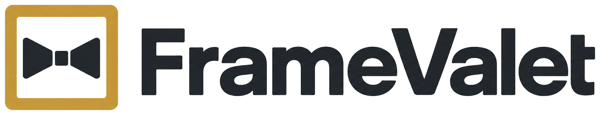

<p align="center">
  
</p>

Self-hosted, multi-user photo and art manager for Samsung Frame TVs. The family
uploads photos from any phone or laptop; FrameValet optimizes them (HEIC
included), pushes them to Art Mode with a matte and the right date, and keeps
everything in sync, even when the TV is off.

## Features

- **Multi-TV**: manage several Frame TVs at once, each with its own pairing,
  matte default, resolution, queues, Art Mode settings, and schedules.
- **Upload anything**: HEIC/HEIF (iPhone default), JPEG, PNG, TIFF, WebP, BMP,
  GIF. Auto-orientation, ICC-to-sRGB conversion (no washed-out colors), and
  metadata stripping happen on every ingest.
- **Originals are the source of truth**: full-resolution originals are stored;
  the TV-ready 4K (or 1080p) render happens at push time and is cached. Crop a
  photo in the built-in editor any time; it re-renders from the original and
  replaces itself on the TV with zero quality loss.
- **Crop in the browser**: drag-handle crop editor with free/16:9/3:2/1:1
  presets, on phone or desktop. No automatic cropping, ever; an optional
  blur-fill style is available for portraits.
- **Queue-first**: uploads succeed instantly; TVs that are off just accumulate
  a queue that drains when they return. Everything resumes after restarts.
- **Library management**: favorites, tags, filtering, and multi-select bulk
  actions (tag, favorite, send to TV, remove from TV, delete). SHA256 dedupe
  means re-uploads are rejected and re-renders are cache hits.
- **Full Art Mode control** per TV: art mode on/off, brightness, color
  temperature, motion timer, motion sensitivity, brightness sensor, the TV's
  own slideshow (interval + shuffle), and matte styles.
- **App-driven schedules** per TV: rotate the displayed photo on an interval,
  random / sequential / favorites-weighted, with optional time-of-day windows,
  day-of-week filters, and tag filters.
- **Folder watcher with mirror semantics**: point it at a folder; files that
  appear are ingested and pushed, files that disappear are removed from the
  library and TVs. Pair it with rclone for **OneDrive/Google Drive/Dropbox**
  sync: drop a photo in a cloud folder, it shows up on the wall.
- **External sources**: browse and import from Openverse, NASA APOD, and
  Reddit out of the box; Unsplash, Pexels, Pixabay, and Rijksmuseum with free
  API keys.
- **Import from the TV**: adopt everything already in My Photos (with
  thumbnails) so the app manages your existing collection.
- **Respects other sources**: photos added via SmartThings show as "external"
  and are never touched automatically.
- **Multi-user with an admin panel**: local accounts (argon2), roles, per-user
  permissions. Members delete only their own uploads by default.
- **TV Doctor**: per-TV diagnostics that turn every Samsung failure mode into
  the exact remote-control menu fix, plus a guided pairing wizard.
- **White-label**: brand name, logo, and accent color are configurable.
- **Portable pairing**: export a TV connection (host + client name + token) as
  env vars and move the whole install without re-pairing.

Everything is configurable in the web UI; every app-wide setting can instead be
pinned by an env var (env always wins and the UI says so).

## Quick start (Docker)

```yaml
services:
  framevalet:
    image: ghcr.io/KD2PDL/framevalet:latest
    restart: unless-stopped
    ports: ["8470:8470"]
    volumes:
      - ./data:/data
      # optional, for OneDrive/cloud sync (create the remote with `rclone config`):
      # - ~/.config/rclone:/root/.config/rclone:ro
```

`docker compose up -d`, open `http://<host>:8470`, create the admin account,
add your TV, and follow the Doctor to pair (someone presses **Allow** on the
TV remote, once, ever).

## Quick start (Proxmox LXC)

On a Proxmox VE host:

```bash
bash -c "$(curl -fsSL https://raw.githubusercontent.com/KD2PDL/framevalet/main/proxmox/install.sh)"
```

Creates an unprivileged Debian container running framevalet under systemd,
with rclone preinstalled.

## OneDrive (or any cloud folder) sync

1. `rclone config` (once, in the container/host) and create a remote, e.g.
   `onedrive`.
2. Admin > Settings: set **rclone remote** to `onedrive:Frame TV Photos` and
   enable the **folder watcher**.
3. Done. FrameValet syncs the folder on an interval and mirrors it: photos
   added to the folder are processed and pushed; photos removed from the
   folder are removed from the TVs and library.

## Requirements and honest caveats

- A Samsung **Frame** TV on the same LAN as framevalet. Tested against a 2025
  QN55LS03H; the local art API generally covers 2021+ models.
- **Samsung is actively restricting this API in newer firmware.** If it works
  on your firmware today, consider disabling the TV's automatic updates; after
  any update, run the TV Doctor to re-verify. If Samsung removes the API,
  framevalet degrades to a clearly-labeled unreachable queue rather than
  breaking.
- Give each TV a DHCP reservation so its IP never changes.
- Reddit's anonymous API is blocked on some networks; the other sources are
  unaffected.

## Environment variables (all optional)

| Var | Purpose |
|---|---|
| `DATA_DIR` | Data directory (default `./data`; the Docker image uses `/data`) |
| `PORT`, `HOST` | Listen address (default `8470`, `0.0.0.0`) |
| `TV_HOST`, `TV_NAME`, `TV_MAC`, `TV_CLIENT_NAME`, `TV_TOKEN` | Seed the first TV on an empty install; `TV_TOKEN` skips re-pairing |
| `ADMIN_USER`, `ADMIN_PASSWORD` | Headless first-boot admin creation |
| `APP_SECRET` | Session secret (auto-generated if unset) |
| `BRAND_NAME`, `BRAND_ACCENT`, `BRAND_LOGO` | White-label pinning |
| `DEFAULT_STYLE` | `fit` (default, never crops) or `blurfill` |
| `JPEG_QUALITY`, `UNSHARP`, `RECONCILE_MINUTES` | Render/sync tuning |
| `WATCH_ENABLED`, `WATCH_INTERVAL`, `RCLONE_REMOTE`, `RCLONE_INTERVAL` | Folder watcher + cloud sync |
| `UNSPLASH_KEY`, `PEXELS_KEY`, `PIXABAY_KEY`, `NASA_KEY`, `RIJKSMUSEUM_KEY` | External source keys |

## Security notes

framevalet is designed for a home LAN. Auth is required for every page and
every image byte, passwords are argon2-hashed, and sessions are server-side.
For remote access, put it behind Tailscale or a VPN; don't port-forward it.

## License

MIT © KD Systems, Inc.
